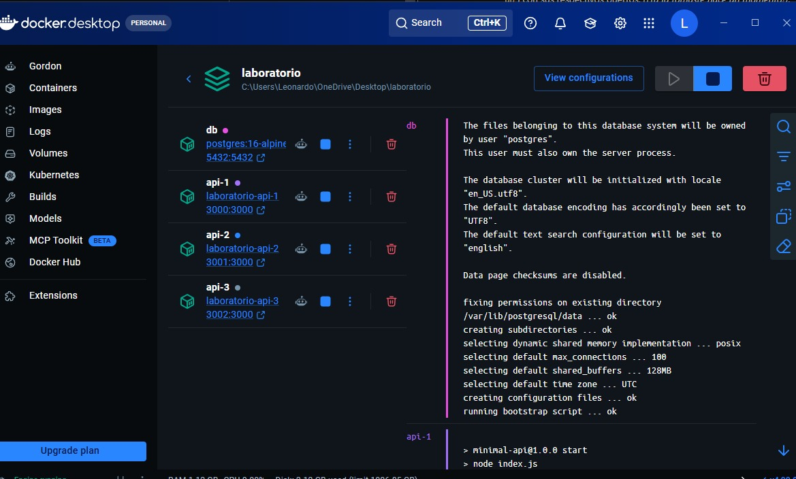
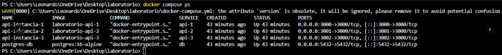

Variables definidas en el archivo `.env`:
- MESSAGE="Hola, soy Leonardo - Laboratorio 02 Docker Compose"
- POSTGRES_USER=postgres
- POSTGRES_PASSWORD=mysecretpassword
- POSTGRES_DB=laboratorio_db
- POSTGRES_PORT=5432

---

# Creditos
- **Docente:** Walter Ivan Leturia Rodriguez
- **Estudiante:** Leonardo

---

# ETC

## 1. Preguntas Teóricas del Laboratorio

### Tipos de redes que existen en Docker:

1. **Bridge (Puente):**
   - Es el controlador de red por defecto en Docker.
   - Crea una red virtual interna y privada para que los contenedores en el mismo host puedan comunicarse entre sí mediante resolución DNS interna (usada en este laboratorio con `red-laboratorio`).

2. **Host:**
   - Elimina el aislamiento de red entre el contenedor y el host local.
   - El contenedor utiliza directamente los puertos y la red de tu computadora sin mapeos.

3. **Overlay:**
   - Permite la comunicación entre contenedores alojados en diferentes máquinas o nodos (usado en Docker Swarm / Kubernetes).

4. **Macvlan:**
   - Asigna una dirección MAC física al contenedor, haciéndolo visible como un dispositivo físico en la red local.

5. **None:**
   - Desactiva toda la red del contenedor; queda totalmente aislado del exterior y de otros contenedores.

---

### Tipos de volúmenes / almacenamiento en Docker:

1. **Named Volumes (Volúmenes con nombre):**
   - Gestionados por Docker en una ruta reservada (`/var/lib/docker/volumes/`). Son independientes del ciclo de vida del contenedor (si el contenedor se apaga o borra, los datos no se pierden). Es el recomendado para bases de datos (usado aquí con `postgres_data`).

2. **Bind Mounts (Montajes vinculados):**
   - Conecta una carpeta de tu computadora directamente con una carpeta dentro del contenedor. Los cambios en el código se ven en tiempo real.

3. **tmpfs Mounts:**
   - Guarda los datos solo en la memoria RAM del host. Cuando el contenedor se apaga, los datos se eliminan.

---

## 2. Evidencias de Despliegue

### Estado de los contenedores (`docker compose ps`)

### Verificación de la API en el Navegador
